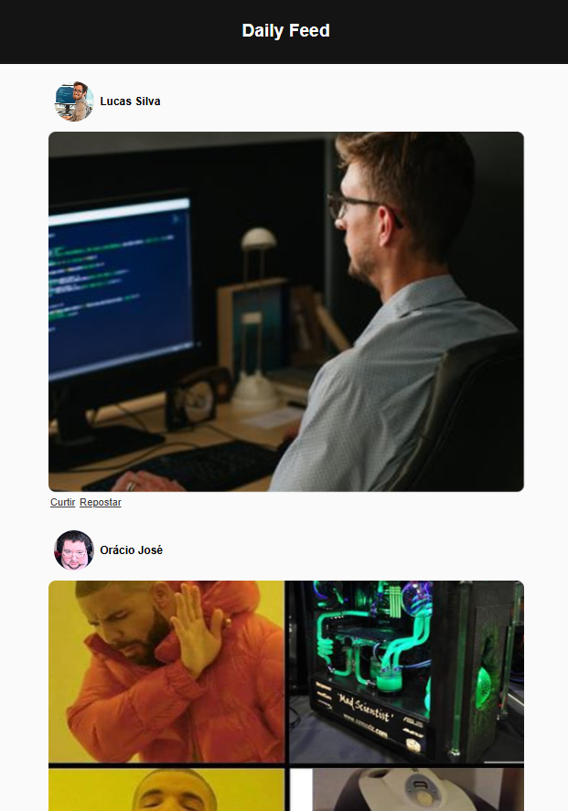

# Social Media Feed Page

This is my **second project**, a **social media-style feed page** built with **HTML** and **CSS** to practice web development. It features a **responsive layout** mimicking a social media feed with posts. This project is part of my journey to become a **full-stack developer**.

## How to Run
- **Option 1**: Clone the repository and open `index.html` in a browser.
- **Option 2**: Access this url: https://simeimoda.github.io/feed-page/

## Screenshot

